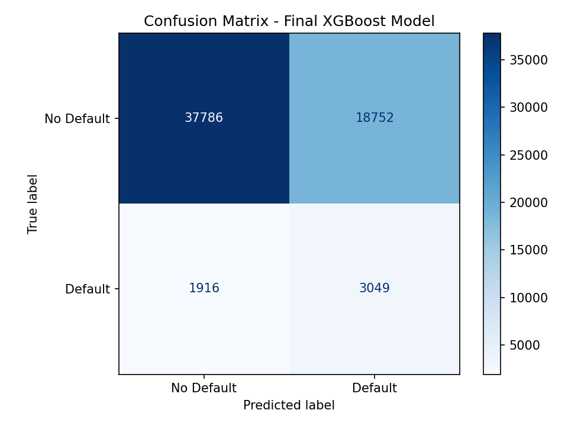
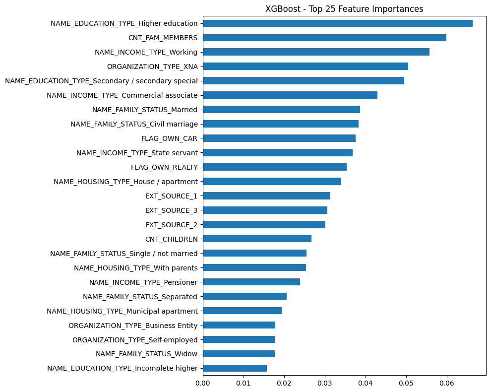
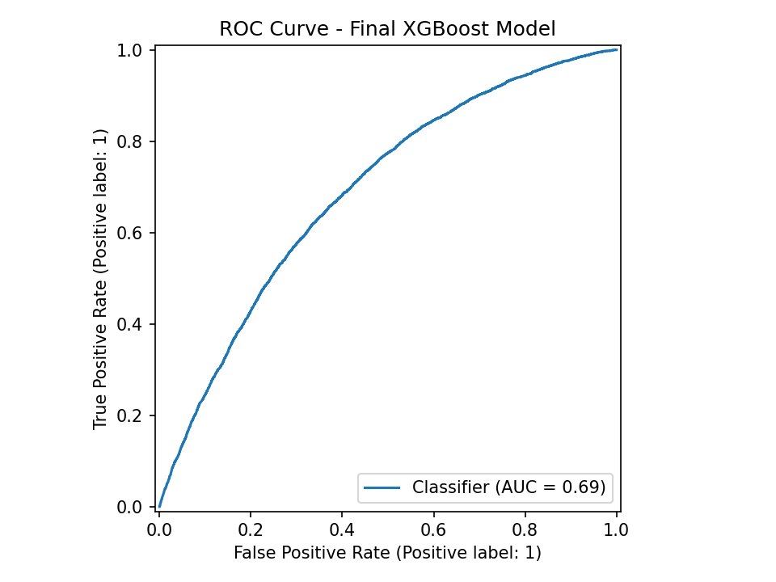

# Loan Default Prediction & Credit Risk Analysis

> End-to-End Machine Learning Project | Python · XGBoost · SMOTE · Power BI

**Author:** Gautam Kumar Kanojia  |  **GitHub:** [gautam-kumar-7590](https://github.com/gautam-kumar-7590)  |  **LinkedIn:** [GautamKumarKanojia](https://linkedin.com/in/GautamKumarKanojia)  |  progautam54@gmail.com

---

## 1. Project Overview

A complete end-to-end ML pipeline to predict the probability of loan default for credit applicants. Built on the Home Credit dataset, this project covers the full data science workflow — EDA, preprocessing, feature engineering, multi-model training, hyperparameter optimization, threshold tuning, and deployment-ready output.

**Final deliverables:** a trained XGBoost model (`.pkl`), a Power BI dashboard for non-technical stakeholders, and predictions for all 307,511 applicants exported to CSV.

---

## Dashboard Preview


## 2. Business Problem

> *"Can we predict, at the time of application, whether a borrower is likely to default on their loan?"*

In fintech and financial services, identifying high-risk applicants before disbursement is critical to portfolio health and regulatory compliance. This model is calibrated to **maximize recall for defaulters (Class 1)**, accepting a precision trade-off to flag as many high-risk applicants as possible before approval.

---
## Model Scores


## 3. Dataset

| Attribute | Detail |
|---|---|
| Source | Home Credit Default Risk (Kaggle) |
| Training Records | 307,511 applicants |
| Test Records | 48,744 applicants (unlabelled) |
| Target Variable | `TARGET` — 0 = No Default, 1 = Default |
| Class Imbalance | ~8.07% defaulters (severe imbalance) |
| Features | 120+ raw features (income, education, family status, housing, external credit scores, etc.) |

---
Download the dataset from Kaggle:
👉 https://www.kaggle.com/c/home-credit-default-risk/data
Place `application_train.csv` and `application_test.csv` in the project folder.

## 4. Technology Stack

| Category | Tools & Libraries |
|---|---|
| Language | Python 3.13 |
| Data Manipulation | Pandas, NumPy |
| Machine Learning | Scikit-learn (Logistic Regression, KNN, Random Forest), XGBoost |
| Imbalanced Data | imbalanced-learn (SMOTE) |
| Model Evaluation | classification_report, roc_auc_score, ConfusionMatrixDisplay, precision_recall_curve |
| Pipeline & CV | sklearn Pipeline, StratifiedKFold, RandomizedSearchCV |
| Visualization | Matplotlib, Seaborn |
| Dashboard | Power BI Desktop |
| Model Persistence | Joblib (.pkl) |
| Environment | VS Code + Jupyter Notebook |

---


## 5. Data Preprocessing & Feature Engineering

- **Missing Values:** Median imputation for numerical columns; mode imputation for categoricals
- **Outlier Treatment:** Domain-appropriate clipping on financial columns (AMT_INCOME_TOTAL, AMT_CREDIT, etc.)
- **Categorical Encoding:** One-hot encoding via `get_dummies`; high-cardinality columns (e.g., ORGANIZATION_TYPE with 58+ categories) filtered post-encoding using XGBoost feature importance
- **Class Imbalance:** SMOTE applied inside a Pipeline (per fold) to prevent data leakage; `scale_pos_weight` in XGBoost for additional minority class penalization

---

## 6. Models Trained & Comparison

Threshold of **0.30** applied across all models initially to improve default detection.

| Model | Accuracy | AUC-ROC | Class-1 Recall | Overfit Status |
|---|---|---|---|---|
| Logistic Regression | 90.76% | 0.7343 | 14% | Moderate |
| K-Nearest Neighbors | 83.57% | 0.6090 | 25% | High |
| Random Forest | 87.87% | 0.6906 | 20% | Moderate |
| **XGBoost (Final)** | **85.41%** | **0.7017** | **46%** | **Low (CV ≈ Test)** |

XGBoost selected as final model: best default recall after threshold optimization, highest AUC-ROC, and stable generalization via Pipeline + StratifiedKFold CV.

---

## 7. Key Challenges & Solutions

| Challenge | Root Cause | Solution |
|---|---|---|
| Severe class imbalance | ~8% defaulters only | SMOTE oversampling + `scale_pos_weight` in XGBoost |
| Low default recall | Default 0.5 threshold biased toward majority class | Threshold optimized via Precision-Recall curve → **0.2125** |
| Model overfitting | XGBoost + SMOTE showed high CV-to-test gap | Rebuilt with sklearn Pipeline + StratifiedKFold (5-fold); SMOTE inside each fold |
| High null values | Missing values across multiple columns | Median imputation (numerical), mode imputation (categorical) |
| High-cardinality categoricals | ORGANIZATION_TYPE had 58+ unique values | One-hot encoding + post-encoding feature selection via XGBoost importance |

---

## 8. Final Model Performance

### Configuration

```
Algorithm:       XGBoost Classifier
n_estimators:    200       learning_rate:    0.05      max_depth:        5
subsample:       0.8       colsample_bytree: 0.7       min_child_weight: 3
reg_alpha:       0.1       reg_lambda:       1.5
Threshold:       0.2125 (optimized via Precision-Recall curve)
Cross-validation: StratifiedKFold (5 folds) | Mean CV AUC: 0.6968
```

### Classification Report (Test Set)

| Class | Precision | Recall | F1-Score |
|---|---|---|---|
| No Default (Class 0) | 0.95 | 0.67 | 0.79 |
| Default (Class 1) | 0.14 | 0.61 | 0.23 |
| **Overall Accuracy** | | **0.664** | |
| **AUC-ROC** | | **0.6906** | |

### Key Observations

- Model identifies **61% of actual defaulters** (Class 1 Recall) — the primary business objective
- AUC-ROC of **0.6906** shows solid discriminative ability given severe class imbalance
- Confusion matrix: 37,786 true negatives | 3,049 true positives on test set
- Top predictive features: Education Type, Family Member Count, Income Type, Organization Type, EXT_SOURCE_1/2/3

---

## Model Results




## 9. Project Deliverables

| File | Description |
|---|---|
| `Loan_Prediction_File.ipynb` | Complete Jupyter Notebook with all code, outputs, and analysis |
| `loan_default_xgboost_model.pkl` | Saved XGBoost model via Joblib for reuse and deployment |
| `loan_predictions_final.csv` | Predictions for all 307,511 applicants with default probability scores |
| `loan_default_dashboard.pbix` | Power BI dashboard — default rate by income type, education, family status, housing, org type |
| `confusion_matrix.png` | Confusion matrix of final XGBoost model on test set |
| `output.png` | XGBoost Top 25 Feature Importances bar chart |

---

## 10. How to Run

**Prerequisites**

```bash
pip install pandas numpy scikit-learn xgboost imbalanced-learn matplotlib joblib
```

1. Clone the repository and navigate to the project folder
2. Download the [Home Credit dataset from Kaggle](https://www.kaggle.com/c/home-credit-default-risk/data) and place `application_train.csv` and `application_test.csv` in the project folder
3. Open `Loan_Prediction_File.ipynb` in VS Code or Jupyter and run all cells sequentially
4. Open `loan_default_dashboard.pbix` in Power BI Desktop to explore the interactive dashboard

---

*Gautam Kumar Kanojia  |  [GitHub: gautam-kumar-7590](https://github.com/gautam-kumar-7590)  |  [LinkedIn: GautamKumarKanojia](https://linkedin.com/in/GautamKumarKanojia)  |  progautam54@gmail.com*
